# M E S H T A S T I C   -   Ч Т О   Э Т О   Т А К О Е ?

**[MESHTASTIC](http://meshtastic.org/)** - это [радио](#радио) [сеть](#сеть) из [маломощных](#мощность) [малогабаритных](#габариты) [ретрансляторов](#ретранслятор), в которой можно передавать текст, набранный на своём смартфоне, подключённом к своему узлу сети = мештастику по блютусу или по вайфаю. Так же можно передавать координаты, если есть встроенный GPS, и смотреть их на [карте в смартфоне](#карта), температуру, давление и т. д. Файлы, видео и голос передавать нет возможности.

Общаться можно в общем чате или только с одним любым узлом в персональном чате. Общение передаётся в эфир в зашифрованном виде - подслушать вас будет очень тяжело. Практически все узлы имеют аккумуляторное питание, поэтому сеть будет работать и даже если пропадёт напряжение в электросети. Сеть децентрализована, это значит, что нет сервера = центра управления сетью.

Cеть полезна для группы в походах, где нет сотовой связи станет крайне полезной, если отключили мобильный интернет или сотовую связь или пропало напряжение в сети. Это проект с открытым исходным кодом, за вами не будут шпионить и можно доработать проект под себя.

Если вы хотите присоединиться к этой сети, вам желательно вступить в группу Meshtastic [вашего города](https://t.me/meshtastic_russia/45946) в телеграмме и узнать какие настройки мештастика используются в вашем городе. После этого нужно определиться, какого типа вам нужен мештастик: стационарный [автономный](#автономный) или стационарный [домашний](#автономный) или мобильный [носимый](#носимый) или [возимый](#возимый). От этого будут зависеть требования к устройству.

Можно купить сразу [готовое](#готовый) устройство, а можно и [самим спаять](#самодельный). После получения или изготовления конструкции её надо прошить последней прошивкой мештастика. Для этого надо с браузера Хром зайти на сайт [флешера](https://flasher.meshtastic.org/) мештастика, выбрать свой вариант железа, подключить по USB плату контроллера к компьютеру, выбрать прошивку и прошить прошивку.

В любом варианте нужна будет антенна. Так как идеология мештастика требует связи со всеми соседями, то антенна должна быть всенаправленной по горизонту, но если пока соседей нет и ближайшие ноды находятся только в одном направлении, то можно временно, пока не появятся соседи, поставить наружную направленную антенну с большим коэффициентом усиления типа волновой канал = Уда-Яги или антенну Харченко.

Антенны нужно подключать к мештастику или напрямую, если это возможно, или через коаксиальный [СВЧ](#свч) кабель с волновым сопротивлением 50 Ом, с как можно более толстым кабелем и как можно малой длиной и желательно, чтобы электрическая (с учётом коэффициентом укорочения данного кабеля) была равна целому числу лямбд пополам, тогда измерения параметров антенны прибором NANOVNA, будут корректными, а не трансформированы кабелем в произвольные значения.

---

## РАДИО {#радио}

Нода связывается с другими нодами по радио на частотах 868 или 433 мегагерца, не используя при этом, ни вайфай, ни сотовую связь, ни мобильный интернет. Эти частоты разрешены в РФ любому гражданину и не требуется никаких других разрешений.

## СЕТЬ {#сеть}

Сеть, в которой каждый узел сети является ретранслятором, называется MESH сетью, отсюда и первая часть слова Meshtastic. Вторая часть слова от слова Tactic - тактическая. Использование ретрансляции помогает сильно расширить сеть, но при большом количестве узлов сеть просто захлёбывается.

## МОЩНОСТЬ {#мощность}

Использование мештастиком модуляции [LoRa](#лора) = Long Range = Большая Дальность позволяет иметь большую дальность радиосвязи при малых мощностях радиопередатчиков, а соответственно, и малую ёмкость аккумуляторов, что очень важно в походах. Официально разрешённая максимальная мощность передатчиков равна 100 милиВатт = 0,1 Ватта.

Идеология сети требует, чтобы мощность у всех узлов была одинаковая, так как связь должна быть ДВУХСТОРОННЕЙ, поэтому задирать мощность своего передатчика не имеет смысла и это вредит сети - ты им кричишь, а сам не слышишь их.

## ГАБАРИТЫ {#габариты}

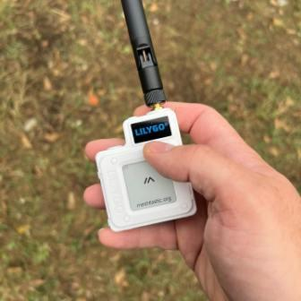

## РЕТРАНСЛЯТОР {#ретранслятор}

Это приёмопередатчик, который принимает пакет данный и потом передаёт его в эфир, ожидая, когда канал передачи освободится.

## КАРТА {#карта}

## ЛОРА {#лора}

LoRa - это новый тип модуляции, позволяющей принимать сигналы, которые меньше шума в 10 раз и это позволяет иметь малую мощность передатчика при той же дальности связи. Модуляция широкополосная, но она мало мешает другим станциям и обычные станции мало ей мешают.

Процесс передачи информации происходит так: передатчик начинает излучать в эфир немодулированную частоту, называемую несущей и начинает линейно увеличивать её частоту в широких пределах, максимально до 500 килоГерц. Такой тип модуляции называется ЛЧМ = линейно частотная модуляция и один такой её переход называется чирпом, почти как чирк спичкой. Предатчик делает несколько таких чирпов и это нащывается преамбула пакета информации.

Приёмник запоминает частоты начала и конца чирпов, а потом передатчик начинает делать такие чирпы в другую сторону, это означает, что передаётся сама информация, но чирпы при этом сдвинуты на определённую величину и именно эта величина является передаваемой информацией.

В приёмнике есть гетеродин и смеситель, как в обычном супергетеродинном приёмнике и гетеродин во время передачи информации тоже свипирует=чирпает по частоте, синхронно с передатчиком. На выходе смесителя, как обычно, образуется сумма и разность гетеродина и принимаемого сигнала. Сумма с удвоенной скоростью отфильтровывается фильтром, а разность частот как раз равна сдвигу чирпа = это и есть информация. Во врема чирпа эта частота постоянна и легко детектируется даже в очень сильных шумах.

## АВТОНОМНЫЙ {#автономный}

Достаточно иметь в таком только малопотребляющий контроллер, модем с мощностью 20 дБм = 100 мВт = 0,1 Ватта и датчики по желанию: температуры, давления, влажности, напряжения, тока, мошности. GPS, дисплей, кнопка не нужны. Нужен аккумулятор, могущий заряжаться ниже 0 градусов или литиевый, но его надо помещать в термостат, который обеспечивает ему температуру не ниже +5 и не выше +45 градусов. Нужна солнечная панель, достаточной мощности.

**ДОМАШНИЙ.** Такой мештастик обязательно должен иметь бесперебойный источник питания, рассчитанный на несколько дней работы без напряжения в сети, иначе это просто игрушка, бесполезная в нужное время. GPS не нужен, так как он может врать при работе РЭБа. Координаты прописываются статические программно.

Антенна домашнего мештастика может стоять на подоконнике и смотреть в окно, если стекло не металлизировано, что проверяется выносом её за окно или стоять на балконе или на сплите. Идеально антенна должна быть на крыше на мачте, мештастик подключён к ней вч коаксиальным кабелем минимальной длины, кратной элктрической длине лямбда пополам. Лямбда - это длина волны с данной частотой. К мештастику на мачте из квартиры подводится только питание 5 Вольт по обычному двухпроводному проводу, от стоящего дома бесперебойного источника питания с аккумулятором с ёмкостью, больше 5 А/ч. Контроллер и модем тоже желательно ставить малопотребляющие, чтобы работа от аккумулятора была дольше, если нет других целей.

## НОСИМЫЙ {#носимый}

Такой мештастик должен иметь малопотребляюшие контроллер, модем с малогабаритной антенной, модуль GPS, дисплей, кнопки и аккумулятор. Таких устройств много на Али, Озоне и Авито.

## ВОЗИМЫЙ {#возимый}

Такой мештастик может быть просто носимым в кабине автомобиля с родной антенной или с выносной на магните автоантенной вместо родной.

## ГОТОВЫЙ {#готовый}

Такие готовые конструкции продают на Алиэкспресс, на Озоне, на Авито и Юле. Поиск нужно вести по ключевым словам "Meshtastic 868". При покупке надо проверять, поддерживает ли мештастик её или нет на [сайте](https://meshtastic.org/docs/hardware/devices/) мештастика.

Надо учитывать, что конструкции с контроллером [nRF52840](meshtastic/NRF52840.pdf) более экономичные, чем с контроллером [ESP32](meshtastic/mesh_17.jpg) с любыми буквами. Модемы в конструкциях должны быть на современных чипах SX1262, обязательно с интефейсом SPI, а не на устаревших SX1278 или на других, которые могут совсем не подходить к мештастику.

## САМОДЕЛЬНЫЙ {#самодельный}

Такой мештастик можно спаять самому, прикупив к нему модуль контроллера [ESP32](meshtastic/mesh_17.jpg) или маломощный модуль контролера [nRF52840](meshtastic/NRF52840.pdf), а также модуль LoRa [модема](https://docs.heltec.org/en/node/ht-ra62/index.html) с чипом SX1262 с интерфейсом I2C, [дисплей I2C OLED](meshtastic/mesh_21.jpg), модуль [GPSa NEO-6M](meshtastic/mesh_20.jpg) или NEO-8M, возможно и модулями всяких датчиков, например [BME280](meshtastic/datchik_bme280_01.jpg), кнопку и аккумуляторы с модулем зарядки.

---

## АНТЕННЫ

### ВСЕНАПРАВЛЕННЫЕ

Такие антенны бывают самые разные. Тут показаны по возрастанию их эффективности = Коэффициенту усиления: [спиральки](#спиральки), [четвертушки](#четвертушки), [полуволновые](#полуволновые) и [коллинеарные](#коллинеарные).

#### СПИРАЛЬКИ {#спиральки}

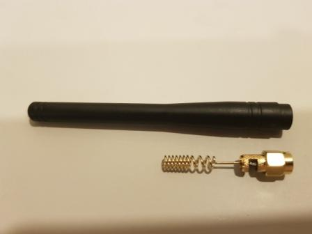

Это самые плохие антенны, но зато самые компактные. Ку равен примерно 1 дБи. Иногда их прячут в длинный пластиковый корпус - всегда проверяйте содержимое корпуса! Если длина корпуса меньше 8-9 см на 868 мГц, то там точно спиралька. Очень плохо работает без противовеса, длиной не менее лямбда на 4. Могут при этом быть причиной перезагрузки или зависания контроллера.

#### ЧЕТВЕРТУШКИ {#четвертушки}

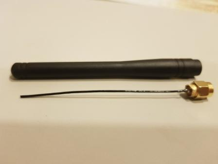

Длина четверти лямбда для 868 мГц составляет примерно 8 см.Эти антенны имеют коэффициент усиления порядка 2 дБи. Очень плохо работают без противовеса, длиной не менее лямбда на 4. Могут при этом быть причиной перезагрузки или зависания контроллера.

#### ПОЛУВОЛНОВЫЕ {#полуволновые}

Стандартная антенна - полуволновой полуволновой вибратор. Коэффициент усиления равен 2-2,5 дБи. Не даёт помех контроллеру. Разновидностями такого диполя являются антенны:

*   **простой разрезной диполь**
    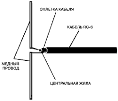
    Реализация:
    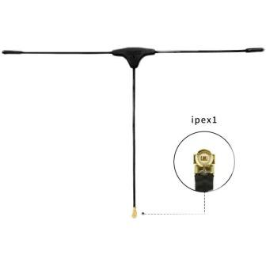
    Требует симметрирования и защиту от статических зарядов.

*   **разрезной коаксиальный диполь**
    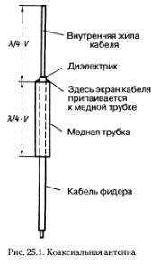
    Реализация:
    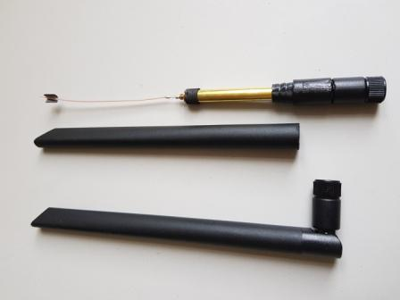
    Не требует симметрирования, но требует защиту от статических электрических зарядо.

*   **джейка**
    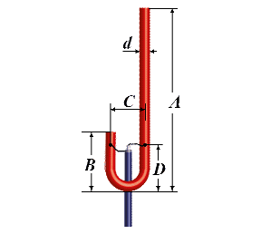
    Не требует симметрирования. Короткозамкнутая - меньше принимает низкочастотных помех и не собирает статического заряда.

*   **граунд плэйн**
    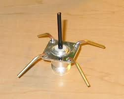
    Не требует симметрирования, но требует защиту от статических зарядов.

#### КОЛЛИНЕАРНЫЕ {#коллинеарные}

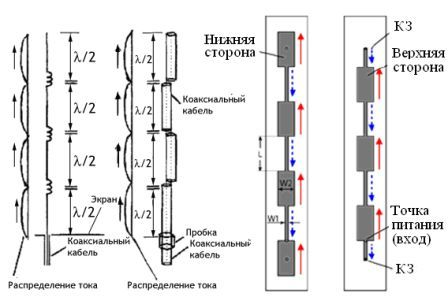
Реализация Радиал А10 868
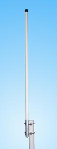

Это самые лучшие по усилению антенны. Принцип работы таких антенн заключается в том, что несколько полуволновых вибраторов выстраиваются вдоль одной линии = коллинеарно и соединяются последовательно через фазирующие устройства, задача которых задержать фазу на 180 градусов и тогда излучение всех вибраторов становится синфазным и складывается.Коэффициент усиления становится достаточно большим.

### НАПРАВЛЕННЫЕ {#направленные}

*   **петлевой диполь**
    .png)
    Короткозамкнутая антенна мало собирает низкочастотных помех и не требует защиты от статических электрических зарядов.

#### КОЛЬЦЕВЫЕ {#кольцевые}

*   **Двойной квадрат**
    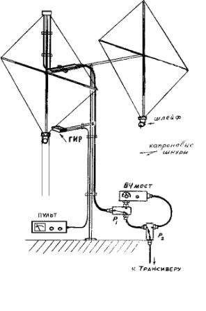
    Имеет коэффициент усиления порядка дБи, суженную диаграмму направленности и тоже короткозамкнутая.

*   **Антенна Харченко**
    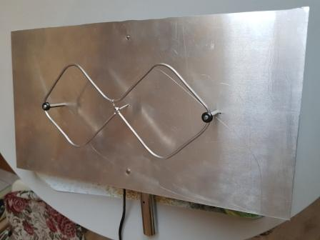
    Имеет коэффициент усиления прядка 9-10 дБи, диаграмма направленности №№ градусов и тоже короткозамкнутая. Требует симметрирования.

#### ЯГИ {#яги}

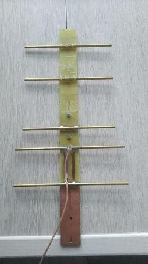

Имеет высокий коэффициент усиления - зависит от количества вибраторов, и узкую диаграмму направленности. Требует симметрирования, на снимке - оно уже есть. Для мештастика трубки должны быть расположены в пространстве вертикально.

---

## СВЧ {#свч}

Отличия такого кабеля: внутренняя изоляция - вспененный диэлектрик или фторопласт, Центральная жила обычно одножильная полированная или посеребрёная. Такие кабели имеют малые потери сигнала на 868 мГц, в отличие от обычных кабелей для коротких волн.

## СПАЯТЬ {#спаять}

Есть схемы самодельного мештастика на [ESP32](meshtastic/MESHTASTIC.BMP) и на [nRF52840](meshtastic/Schematic_Pro-Micro_Pinouts%202024-12-14.pdf). Монтаж желательно выполнять короткими проводами и НЕ располагать рядом с модемом никаких импульсных преобразователей, так как они могут уменьшать чувствительность приёмника.
